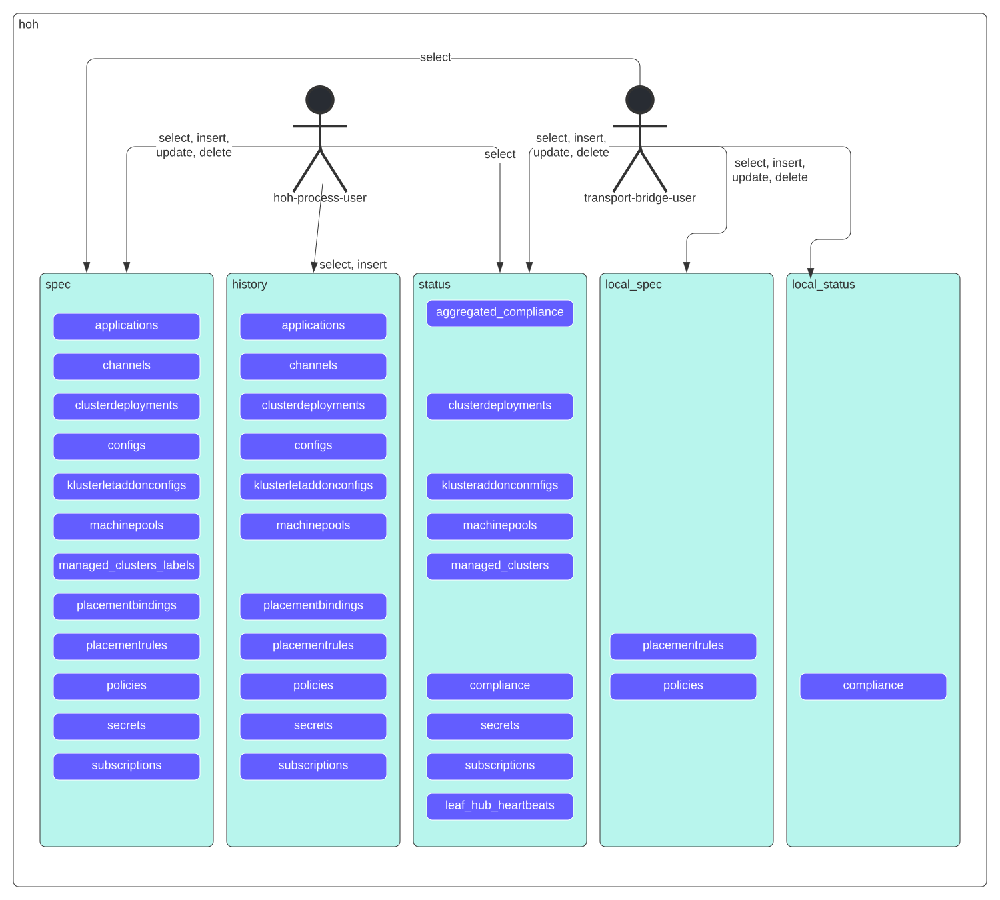

# Install and configure Hub-of-Hubs database

[](/LICENSE)

PostgreSQL serves as the database of [Hub-of-Hubs](https://github.com/stolostron/hub-of-hubs) . This repository contains Ansible playbooks to install, configure and uninstall the database. For common commands to work with the database, see [usage.md](usage.md).

The repository also contains [a go program to run performance tests](db-performance-tests) and [scripts to deploy the database to a Kubernetes cluster](pgo).



Go to the [Contributing guide](CONTRIBUTING.md) to learn how to get involved.

## Getting Started

## Design points

* We use five schemas: `spec`, `status`, `local_spec`, `local_status`, and `history`.
* We save Json in `JSONB` fields.
* We use [the same structure](roles/create_tables/tasks/create_spec_table.yaml) for all the tables in the `spec.schema`.
* `status.schema` tables are defined by [this task](https://github.com/stolostron/hub-of-hubs-postgresql/blob/main/roles/create_tables/tasks/create_status_tables.yaml).
* We do not use foreign keys [due to performance considerations](http://bonesmoses.org/2014/05/14/foreign-keys-are-not-free/).

## Run PostgreSQL with an operator in your Hub of hub cluster
You can follow the [instructions](./pgo/README.md) to:
- set up a PostgreSQL
- use this ansible to set up database schema, tables, and permissions, etc... on the postgres inside your Hoh cluster

## Initial setup if you do not want to run PostgreSQL with an operator

1.  Create `production` file in the main directory with the host name of your machine to install the database, under the `acm` host group `acm`:

    ```
    [acm]
    <your host>
    ```

1.  Create `vault` file with following variables:
    - `vault_ansible_user`: contains the user of the machine where you install the database
    - `vault_ansible_ssh_private_key_file`: the path to the SSH private key file to connect to the machine
	- make sure you set up a ENV varible `DB_LOGIN_USER` and `DB_LOGIN_PASSWORD`, which is the user for creating schema, tables, etc...
    Put the `vault` file into [group_vars/](group_vars/), in the corresponding directory (acm/acm2/acm3/ etc.)

1.  For formatting multiple lines output, add the following lines to your `ansible.cfg`:

    ```
    # Use the YAML callback plugin.
    stdout_callback = yaml
    # Use the stdout_callback when running ad-hoc commands.
    bin_ansible_callbacks = True
    ```

1.  Install `Python3` on the host. On RHEL run: `sudo dnf install python3 python3-devel -y`.

1.  Disable previous `postgresql`. On RHEL run:  `sudo dnf -qy module disable postgresql`

1.  Install `psycopg2` locally:

    ```
    pip3 install psycopg2-binary
    ```

## To install the database (without creating tables)

Run:

```
ansible-playbook install.yaml -i production --ask-vault-pass -l acm
```

## Post installation tasks

1.  Create an admin user. Run inside the VM:

    ```
    sudo -u postgres createuser <admin user> -d
    ```

1.  Grant to the admin all the priviledges on the `hoh` database:

    ```
    sudo -u postgres psql -c `GRANT ALL PRIVILEGES ON DATABASE hoh TO <admin user>;`
    ```

1.  Add the following line to `/var/lib/pgsql/13/data/pg_hba.conf`

    ```
    hostssl hoh     <admin-user>   0.0.0.0/0       scram-sha-256
    ```

1.  Set password for the users. Run inside the VM the following command for each user:

    ```
    sudo -u postgres psql -c '\password <user name>'
    ```

1.  Obtain a private key and a certificate and put them into `server.key` and `server.crt` files in the PostrgeSQL configuration directory.
    If you have Let's Encrypt setup, run on your VM:

    ```
    sudo /etc/letsencrypt/renewal-hooks/deploy/postgresql.deploy
    ```

1.  Configure TLS:

    ```
    ansible-playbook configure_tls.yaml -i production --ask-vault-pass -l acm
    ```
## To create the tables

Note that creating tables does not change the existing tables/indexes. If you want to change an existing table/index, either drop it manually or drop all the tables, see the previous section.

1.  Set the following environment variables:

    *  `DB_LOGIN_HOST` - the host of the database
    *  `DB_LOGIN_USER` - the admin user of the database. It must have permissions to create tables.
    *  `DB_LOGIN_PASSWORD` - the password of the admin user.

1. Run:

   ```
   ansible-playbook create_tables.yaml -i production -l local
   ```

## Psql setup (on the client machine)

1.  Create `/.postgresql` directory if not exists:

    ```
    mkdir -p ~/.postgresql
    ```

1.  Create `root.crt` on the client machine, put it into `~/.postgresql/root.crt`. For example, for
[Let's encrypt](https://letsencrypt.org/) certificates, run the following command:

    ```
    curl https://letsencrypt.org/certs/isrgrootx1.pem --output ~/.postgresql/root.crt
    ```


1.  Use `psql` on the client machine:

    ```
    PGSSLMODE=verify-full psql -h <the PostgreSQL VM host> -U hoh_process_user -W -d hoh
    ```

## To uninstall

Run:

```
ansible-playbook uninstall.yaml -i production --ask-vault-pass -l acm
```

## To drop all the tables

1.  Set the following environment variables:

    *  `DB_LOGIN_HOST` - the host of the database
    *  `DB_LOGIN_USER` - the admin user of the database. It must have permissions to create tables.
    *  `DB_LOGIN_PASSWORD` - the password of the admin user.

1.  Run:

    ```
    ansible-playbook delete_tables.yaml -i production -l local
    ```

## To change the database name

```
ansible-playbook install.yaml -i production --ask-vault-pass -l acm -e "hoh_db=hoh2"
```

## To tune the database

ansible-playbook install.yaml -i production --ask-vault-pass -l acm -e "max_connections=550 shared_buffers=24GB random_page_cost=1.5"

## Troubleshooting

1.  If you get an error about some python library not loaded:
    1. To check that the library is loaded - https://stackoverflow.com/a/42747425
    1. If you have multiple python executable installed, and the library is loaded with one of them but not loaded with another one:
 change the `interpreter_python` entry in `~/ansible.cfg` to the python executable that can load the library.
